<!-- ===== DANGER ZONE: DON'T TOUCH IT ======-->
id: codelab-deployment
status: Published
<!-- ======================================= -->

summary: Laboratorio 04 - Programacion N-Capas
authors: Henry Alexis Flores Lopez
categories: Programacion, Java, SpringBoot

# Integracion Keycloak con SpringBoot (Patron BFF)

<!-- ------------------------ -->
## Conceptos Basicos 
### ¿Que es Keycloak?
Keycloak es un producto de software de código abierto que permite el inicio de sesión único con gestión de identidades y accesos, diseñado para aplicaciones y servicios modernos.

### Patron BFF
El patrón BFF hace referencia al concepto de Backend For FrontEnd. Cuando nosotros diseñamos muchas de nuestras aplicaciones nos encontramos en situaciones en las que tenemos diseñado un FrontEnd realizado en JavaScript contra un Backend desarrollado en la tecnología que nos plazca pero muchas veces enfocado a Servicios REST  . En muchos casos el BackEnd esta diseñado de una forma neutra es decir publica una información de la que cualquier cliente puede beneficiarse . Eso sí cada cliente dispondrá de un interface de usuario diferente a otros . Al publicar la información de forma muy neutra todos los clientes se adaptarán a ella  , pero cada uno de los cuales necesitará realizar un esfuerzo diferente para cargar los datos necesarios que presenta. [Fuente: ArquiteturaJava](https://www.arquitecturajava.com/que-es-el-patron-bff/)

### ¿Por que BFF con Keycloak?
Usando un patron BFF en nuestro Backend tenemos las siguientes ventajas
- #### 1 - Separacion de preocupaciones
    - El frontend se centra en la UI, y no necesita preocuparse por autenticación compleja ni detalles de autorización.
    - El BFF se encarga de la autenticación con Keycloak, gestión de tokens, transformación de datos, y llamadas a APIs internas.
- #### 2 - Seguridad y control de acceso
    - El BFF maneja la validación del JWT, verifica roles/permisos y controla qué rutas están permitidas.
    - El frontend nunca toca directamente Keycloak ni otros microservicios.
- #### 3 - Mejor manejo de tokens
    - El BFF puede usar tokens más seguros (HttpOnly cookies) y mantener tokens de refresco lejos del frontend.
    - También puede actuar como proxy para renovar tokens automáticamente.
- #### 4 - Customizacion por cliente
    - Una app móvil puede tener distintos requerimientos de datos que una app web.
    - Con BFF, cada frontend tiene su propio backend adaptado a sus necesidades (datos resumidos, transformados, cacheados, etc.).
- #### 5 - Facilita cambios sin afectar todo
    - Cambios en un BFF solo afectan a su cliente.
    - Es más fácil de probar, desplegar y mantener.

## Keycloak con Docker
### Instalacion de una instancia de Keycloak
Para esta practica, usaremos una instancia de desarrollo de Keycloak, para esto, utilizaremos docker con la imagen oficial de Keycloak.
Para esto, usaremos el siguiente comando:
```bash
docker run -p 3030:8080 -e KC_BOOTSTRAP_ADMIN_USERNAME=admin -e KC_BOOTSTRAP_ADMIN_PASSWORD=admin quay.io/keycloak/keycloak:26.2.5 start-dev
```
>aside negative
> #### ⚠️ Aclaracion
> Por lo general, los puertos utilizados para Keycloak son el 8080:8080, pero para esta ocasion, ya que nuestra api estara corriendo en el puerto 8080, definiremos que estaremos usando el puerto 8080 interno de nuestro contenedor, expuesto en el puerto 3030 de nuestro ordenador.

### Acceso a la terminal administrativa
La primera vez que realicemos este proceso, puede que tarde un poco, ya que se tendra que descargar la imagen a utilizar.
Una vez que la imagen haya sido descargada y que la instancia este corriendo, accederemos a la siguiente ruta

[Ruta de la instancia](http://localhost:3030/admin)

En la que debera verse la siguiente pantalla

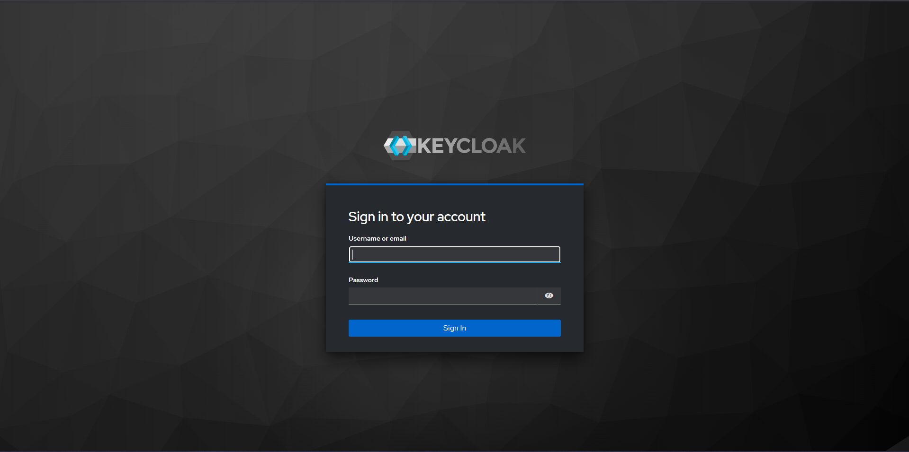


Una vez en esta pantalla, necesitamos las credenciales que hemos determinado en el comando de la creacion de instancia

```bash
KC_BOOTSTRAP_ADMIN_USERNAME=admin -e KC_BOOTSTRAP_ADMIN_PASSWORD=admin
```

En estos parametros es donde se definen las crecenciales de nuestro usuario **temporal**.
Por tanto, nuestras credenciales seran:
#### Username or email
admin
#### Password
admin

Si hemos ingresado los datos correctamente, deberiamos acceder a la siguiente pantalla

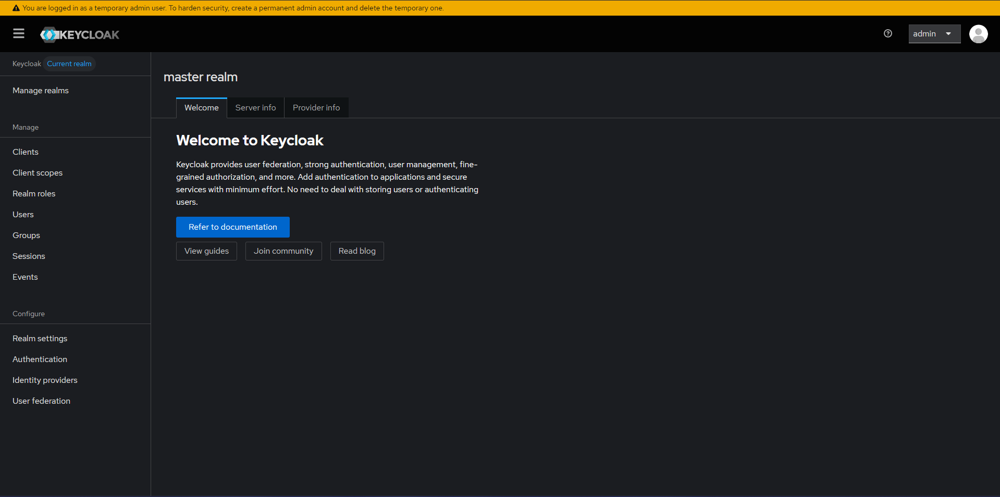

## Configuracion de Keycloak

### Pasos escenciales
Una vez que hayamos entrado en la pantalla administrativa de nuestra instancia, necesitaremos hacer numero cosas escenciales, las cuales son:
- Definir un usuario **no temporal**
- Crear un realm
- Crear un client
- Definir roles

## Definir un usuario **no temporal**
Si vemos la pantalla inicia de nuestra pantalla de inicio, veremos la siguiente advertencia


Para resolver esta advertencia, deberemos seguir los siguientes pasos:

### Acceder a la seccion users
En nuestra barra lateral izquierda, encontraremos una lista de funciones o carateristicas a las que podemos acceder, en este caso, haremos clic en la opcion "Users"


La cual nos mostrara la siguiente seccion


En la cual estara registrado solo nuestro usuario temporal llamado **admin**. 
Haremos clic en el boton azul que dice **Add User**, el cual nos llevara el siguiente formulario

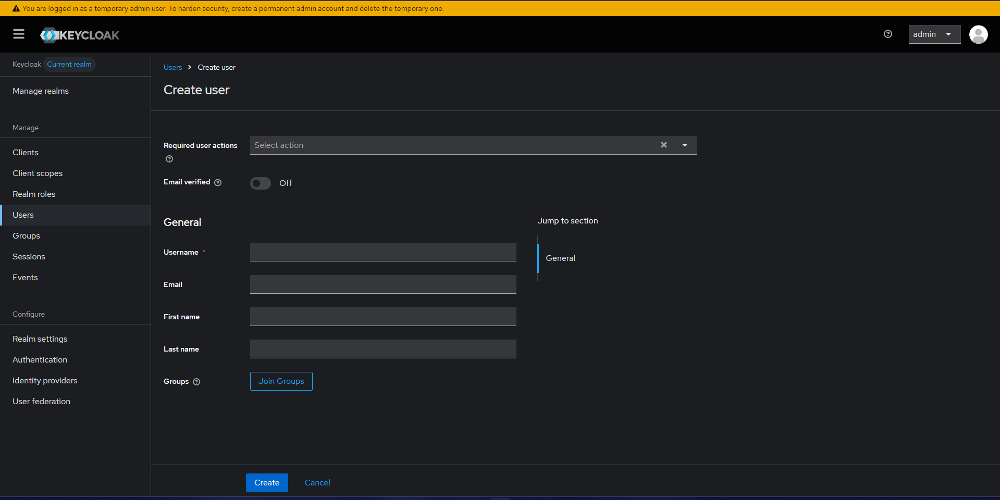

El cual deberemos llenar con los datos que creamos convenientes.

>aside negative
> #### ⚠️ Importante
> Se debe marcar la casilla de **Email verified**. De lo contrario, el usuario estara marcado como **Usuario sin completar** y podria dificultar algunos proceso.

Presionamos el boton **Create** y nos llevara a la siguiente etapa

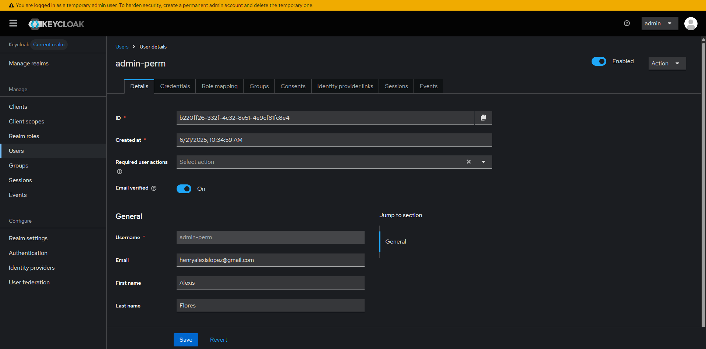

Aca nos interesan dos cosas
- Credentiales
- Role Mapping

### Definir credenciales
Primero nos dirigiremos a **Credentials**, en donde tendremos que definir la manera en la que nuestro usuario accedera a la seccion administrativa.

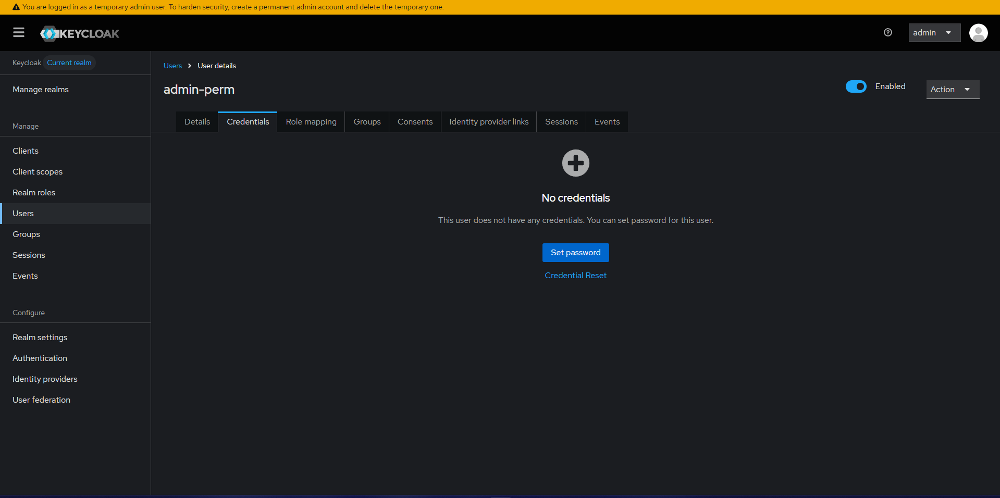

Presionaremos el boton **Set Password** y llenaremos los campos necesarios.

>aside negative
> #### ⚠️ Importante
> Debemos asegurarnos que el atributo con el nombre **Temporary** se encuentre en OFF. De lo contrario, despues del primero Login, tendremos que cambiar la contrasena.

Presionamos **Save** y luego **Save Password** y nuestra contrasena habra sido establecida. 


### Definir roles
Una vez definidas nuestras credenciales, ahora necesitamos definir que el usuario sera el administrador de toda la instancia.
Para esto, primero debemos asegurarnos que nos encontramos en el realm **Master**.
Para ello, en la barra lateral izquierda, encontraremos la opcion llamada **Manage realms**

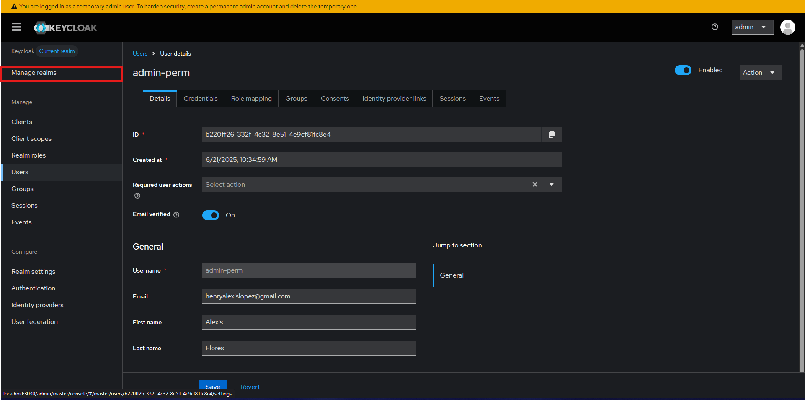

Damos clic, y nos aseguramos de que el Realm con el nombre "mastes" se encuentre con la etiqueta **Current realm**, de la siguiente forma

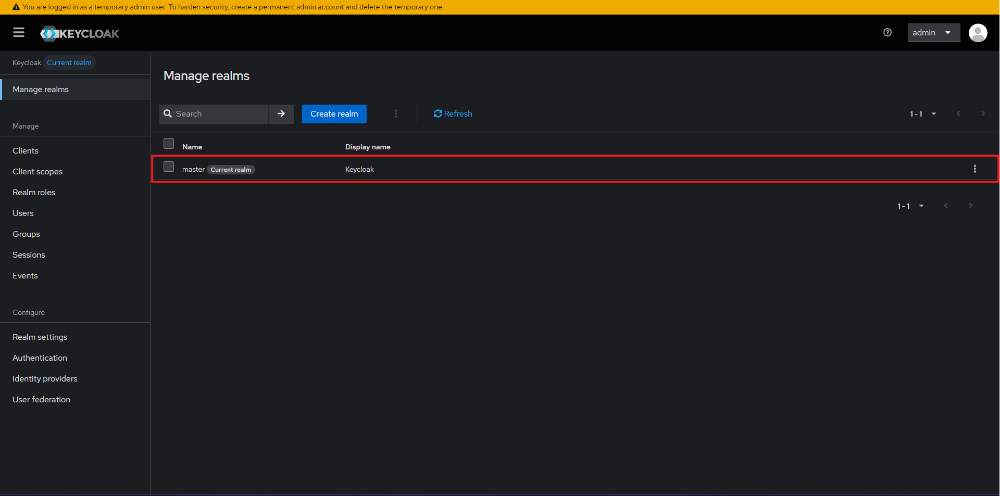

Volvemos a nuestra seccion de usuarios, damos clic en el nombre del usuario que habiamos creados en anterioridad y no dirigiremos al apartado de **Role Mapping**

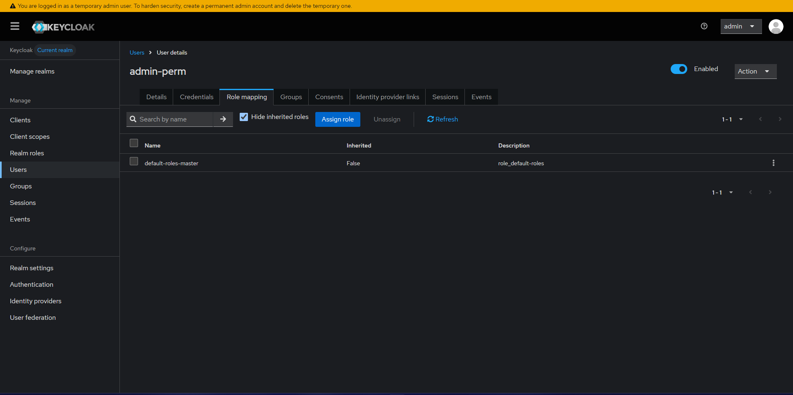

Daremos clic en el boton **Assign role**, la cual desplegara el siguiente menu:

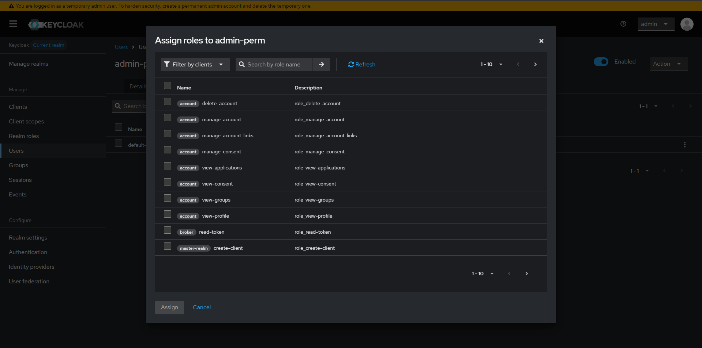

En la parte superior izquierda, encontraremos un icono para filtrar, el cual dice **"Filter by clients"** daremos clic sobre el y seleccionaremos **"Filter by realm roles"**.
Los roles mostrados en pantalla se actualizaran, mostrandonos los siguientes:

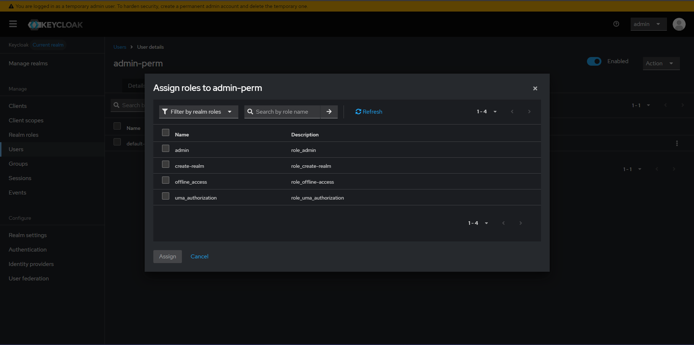

Marcaremos con un cheque el rol que dice **"admin"** y daremos clic en **Assign**.

Una vez asignado, los roles de nuestro usuario deberia verse asi:

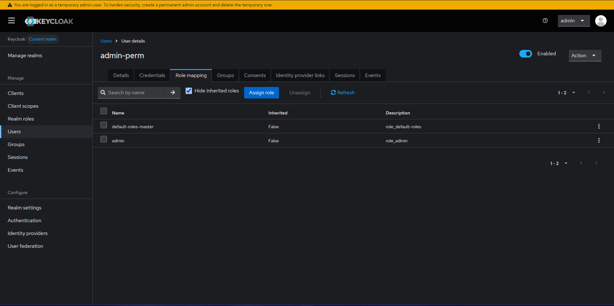

>aside negative
> #### ⚠️ Importante
> Una vez hecho este proceso, debemos ir a la parte superior derecha, hacer clic sobre el desplegable que dice "admin" y hacer un Sign out para iniciar sesion con el usuario que hemos creado con anterioridad.

>aside negative
> #### ⚠️ Eliminacion de usuario temporal
> Cuando hayamos ingresado con nuestro nuevo usuario, deberemos ir al apartado de users y asegurarnos de borrar al usuario temporal
> para ello solo debemos dar clic en el cheque al lado del usuario y luego presionar el botn "Delete user".

## Crear un realm
### ¿Que es un realm?
Un realm en Keycloak (y en general en contextos de seguridad y autenticación) es una unidad de aislamiento que agrupa usuarios, roles, clientes y configuraciones de seguridad de manera completamente independiente de otros realms.

Es decir, podemos tener multiples realm para distintos sistemas, en donde cada uno de sus usuarios, roles, configuraciones, clientes, etc, son distintos.

### Creando un realm
Despues de haber creado nuestro usuarios, habernos logeado y borrado el usuario temporal. 
Necesitamos crear un entorno en donde se estaran almacenando nuestros usuarios, para ello, iremos al apartado de Manage Realms (como lo habiamos hecho con anterioridad)


Y presionaremos el boton **Create realm**, el cual nos desplegara el siguiente formulario

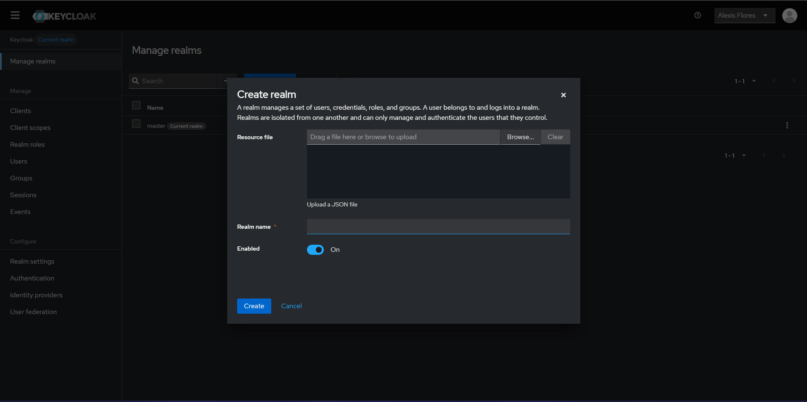

En el cual, solo sera necesario llenar el campo de **Realm name**

>aside negative
> #### ⚠️ Importante
> Deberemos dejar marcada la opcion de Enabled

> aside positive
> #### ✅ Realm creado con exito.
> Automaticamente nuestro realm haya sido creado, nos daremos cuenta que en la parte superior izquierda, el current realm ha camiado
> Si esto no sucede, sera necesario que hagamos el cambio manualmente en la seccion de Manage Realms.

## Crear un client
### ¿Que es un client?
En el contexto de Keycloak, un Client (cliente) es una aplicación que quiere autenticarse usando Keycloak. Puede ser una app web, un frontend, un backend, una app móvil, una API… cualquier cosa que requiera autenticación/autorización gestionada por Keycloak.

### Por que es importante?
Como su concepto lo dice, son aplicaciones que estaran permitidas a autenticarse y a hacer uso de nuestras instancias de keycloak. Ejemplo: Si queremos crear un usuario, las peticiones deben venir desde una fuente confiable que este autorizada por nuestra instancia.

### Creando un client
Para crear un Client, debemos dirigirnos a la seccion de Clients en nuestra pantalla de administracion de Keycloak

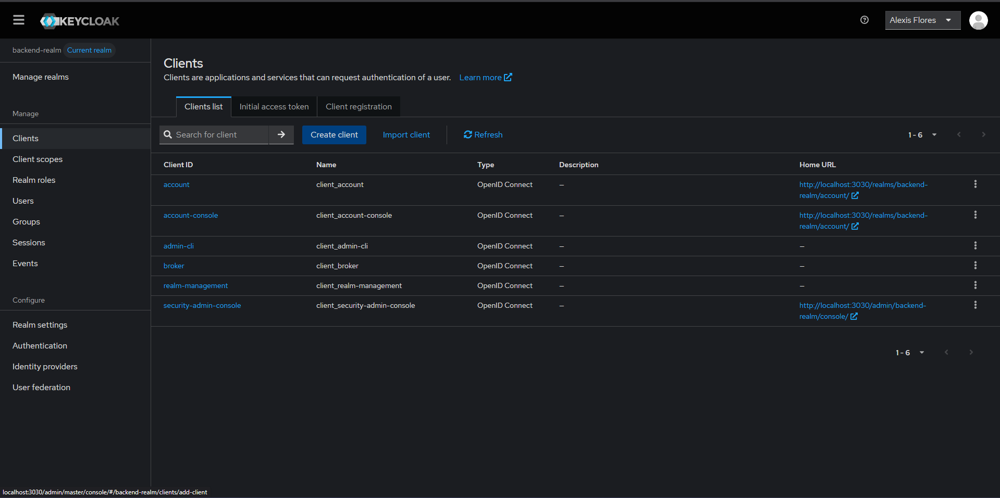

#### Datos generales
Una vez en la seccion, presionaremos el boton de **Create client**, el cual nos dirigira al siguiente formulario:

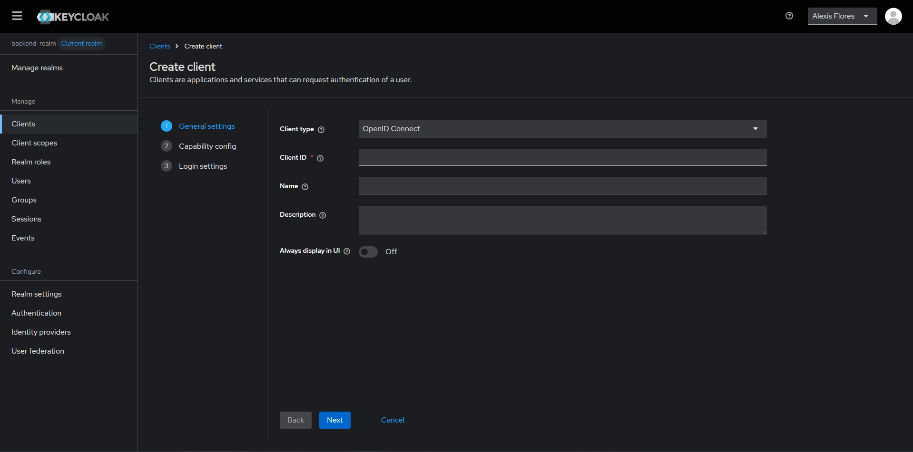

El cual, para este ejemplo llenaremos de la siguiente manera:

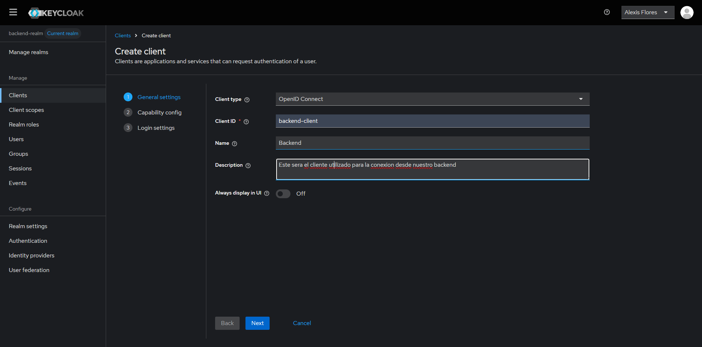

> aside positive
> #### Significado de campos.
> - **Client Type**
> El tipo de conexion y de cliente que se encargara de gestionar la autenticacion, en este caso, OpenID Connect
> - **Client ID**
> Idetificador de nuestro Client (importante recordarlo)
> - **Name**
> Alias de nuestro cliente
> - **Description**
> Una breve descripcion de nuestro cliente
> - **Always display in UI**
> Esta opcion es utilizado si no estamos utilizando el patron BFF. Esta opcion mostrara en la pantalla de login a que cliente se quiere logear. En nuestro caso, no es necesario, ya que las operaciones se estaran realizando a traves de nuestra api.

#### Metodos de autenticacion
Al haber llenado los campos y presionar el boton **Next**, nos dirigira al formulario de metodos de autenticacion. En el cual, para nuestro caso, configuraremos de la siguiente manera:

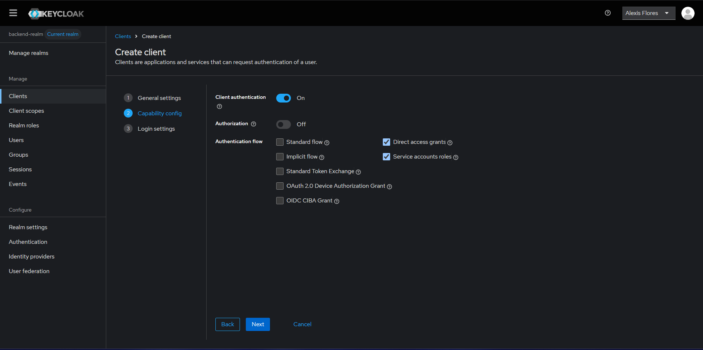

Damos al boton **Next**, acto seguido,  damos en el boton de **Save** 

>aside negative
> #### ⚠️ Importante
> Los campos del formulario **Loggin Settings** no deben llenarse para esta ocasion

> aside positive
> #### ✅ Client creado con exito.

## Definicion de roles