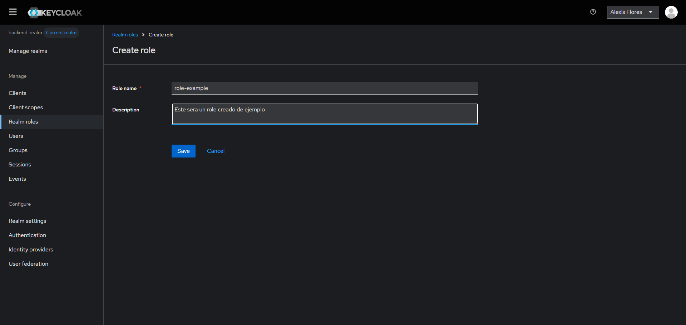

<!-- ===== DANGER ZONE: DON'T TOUCH IT ======-->
id: codelab-deployment
status: Published
<!-- ======================================= -->

summary: Laboratorio 04 - Programacion N-Capas
authors: Henry Alexis Flores Lopez
categories: Programacion, Java, SpringBoot

# Integracion Keycloak con SpringBoot (Patron BFF)

<!-- ------------------------ -->
## Conceptos Basicos 
### ¿Que es Keycloak?
Keycloak es un producto de software de código abierto que permite el inicio de sesión único con gestión de identidades y accesos, diseñado para aplicaciones y servicios modernos.

### Patron BFF
El patrón BFF hace referencia al concepto de Backend For FrontEnd. Cuando nosotros diseñamos muchas de nuestras aplicaciones nos encontramos en situaciones en las que tenemos diseñado un FrontEnd realizado en JavaScript contra un Backend desarrollado en la tecnología que nos plazca pero muchas veces enfocado a Servicios REST  . En muchos casos el BackEnd esta diseñado de una forma neutra es decir publica una información de la que cualquier cliente puede beneficiarse . Eso sí cada cliente dispondrá de un interface de usuario diferente a otros . Al publicar la información de forma muy neutra todos los clientes se adaptarán a ella  , pero cada uno de los cuales necesitará realizar un esfuerzo diferente para cargar los datos necesarios que presenta. [Fuente: ArquiteturaJava](https://www.arquitecturajava.com/que-es-el-patron-bff/)

### ¿Por que BFF con Keycloak?
Usando un patron BFF en nuestro Backend tenemos las siguientes ventajas
- #### 1 - Separacion de preocupaciones
    - El frontend se centra en la UI, y no necesita preocuparse por autenticación compleja ni detalles de autorización.
    - El BFF se encarga de la autenticación con Keycloak, gestión de tokens, transformación de datos, y llamadas a APIs internas.
- #### 2 - Seguridad y control de acceso
    - El BFF maneja la validación del JWT, verifica roles/permisos y controla qué rutas están permitidas.
    - El frontend nunca toca directamente Keycloak ni otros microservicios.
- #### 3 - Mejor manejo de tokens
    - El BFF puede usar tokens más seguros (HttpOnly cookies) y mantener tokens de refresco lejos del frontend.
    - También puede actuar como proxy para renovar tokens automáticamente.
- #### 4 - Customizacion por cliente
    - Una app móvil puede tener distintos requerimientos de datos que una app web.
    - Con BFF, cada frontend tiene su propio backend adaptado a sus necesidades (datos resumidos, transformados, cacheados, etc.).
- #### 5 - Facilita cambios sin afectar todo
    - Cambios en un BFF solo afectan a su cliente.
    - Es más fácil de probar, desplegar y mantener.

## Keycloak con Docker
### Instalacion de una instancia de Keycloak
Para esta practica, usaremos una instancia de desarrollo de Keycloak, para esto, utilizaremos docker con la imagen oficial de Keycloak.
Para esto, usaremos el siguiente comando:
```bash
docker run -p 3030:8080 -e KC_BOOTSTRAP_ADMIN_USERNAME=admin -e KC_BOOTSTRAP_ADMIN_PASSWORD=admin quay.io/keycloak/keycloak:26.2.5 start-dev
```
>aside negative
> #### ⚠️ Aclaracion
> Por lo general, los puertos utilizados para Keycloak son el 8080:8080, pero para esta ocasion, ya que nuestra api estara corriendo en el puerto 8080, definiremos que estaremos usando el puerto 8080 interno de nuestro contenedor, expuesto en el puerto 3030 de nuestro ordenador.

### Acceso a la terminal administrativa
La primera vez que realicemos este proceso, puede que tarde un poco, ya que se tendra que descargar la imagen a utilizar.
Una vez que la imagen haya sido descargada y que la instancia este corriendo, accederemos a la siguiente ruta

[Ruta de la instancia](http://localhost:3030/admin)

En la que debera verse la siguiente pantalla


Una vez en esta pantalla, necesitamos las credenciales que hemos determinado en el comando de la creacion de instancia

```bash
KC_BOOTSTRAP_ADMIN_USERNAME=admin -e KC_BOOTSTRAP_ADMIN_PASSWORD=admin
```

En estos parametros es donde se definen las crecenciales de nuestro usuario **temporal**.
Por tanto, nuestras credenciales seran:
#### Username or email
admin
#### Password
admin

Si hemos ingresado los datos correctamente, deberiamos acceder a la siguiente pantalla


## Configuracion de Keycloak

### Pasos escenciales
Una vez que hayamos entrado en la pantalla administrativa de nuestra instancia, necesitaremos hacer numero cosas escenciales, las cuales son:
- Definir un usuario **no temporal**
- Crear un realm
- Crear un client
- Definir roles

## Definir un usuario **no temporal**
Si vemos la pantalla inicia de nuestra pantalla de inicio, veremos la siguiente advertencia


Para resolver esta advertencia, deberemos seguir los siguientes pasos:

### Acceder a la seccion users
En nuestra barra lateral izquierda, encontraremos una lista de funciones o carateristicas a las que podemos acceder, en este caso, haremos clic en la opcion "Users"


La cual nos mostrara la siguiente seccion


En la cual estara registrado solo nuestro usuario temporal llamado **admin**. 
Haremos clic en el boton azul que dice **Add User**, el cual nos llevara el siguiente formulario


El cual deberemos llenar con los datos que creamos convenientes.

>aside negative
> #### ⚠️ Importante
> Se debe marcar la casilla de **Email verified**. De lo contrario, el usuario estara marcado como **Usuario sin completar** y podria dificultar algunos proceso.

Presionamos el boton **Create** y nos llevara a la siguiente etapa


Aca nos interesan dos cosas
- Credentiales
- Role Mapping

### Definir credenciales
Primero nos dirigiremos a **Credentials**, en donde tendremos que definir la manera en la que nuestro usuario accedera a la seccion administrativa.


Presionaremos el boton **Set Password** y llenaremos los campos necesarios.

>aside negative
> #### ⚠️ Importante
> Debemos asegurarnos que el atributo con el nombre **Temporary** se encuentre en OFF. De lo contrario, despues del primero Login, tendremos que cambiar la contrasena.

Presionamos **Save** y luego **Save Password** y nuestra contrasena habra sido establecida. 


### Definir roles
Una vez definidas nuestras credenciales, ahora necesitamos definir que el usuario sera el administrador de toda la instancia.
Para esto, primero debemos asegurarnos que nos encontramos en el realm **Master**.
Para ello, en la barra lateral izquierda, encontraremos la opcion llamada **Manage realms**


Damos clic, y nos aseguramos de que el Realm con el nombre "mastes" se encuentre con la etiqueta **Current realm**, de la siguiente forma


Volvemos a nuestra seccion de usuarios, damos clic en el nombre del usuario que habiamos creados en anterioridad y no dirigiremos al apartado de **Role Mapping**


Daremos clic en el boton **Assign role**, la cual desplegara el siguiente menu:


En la parte superior izquierda, encontraremos un icono para filtrar, el cual dice **"Filter by clients"** daremos clic sobre el y seleccionaremos **"Filter by realm roles"**.
Los roles mostrados en pantalla se actualizaran, mostrandonos los siguientes:


Marcaremos con un cheque el rol que dice **"admin"** y daremos clic en **Assign**.

Una vez asignado, los roles de nuestro usuario deberia verse asi:


>aside negative
> #### ⚠️ Importante
> Una vez hecho este proceso, debemos ir a la parte superior derecha, hacer clic sobre el desplegable que dice "admin" y hacer un Sign out para iniciar sesion con el usuario que hemos creado con anterioridad.

>aside negative
> #### ⚠️ Eliminacion de usuario temporal
> Cuando hayamos ingresado con nuestro nuevo usuario, deberemos ir al apartado de users y asegurarnos de borrar al usuario temporal
> para ello solo debemos dar clic en el cheque al lado del usuario y luego presionar el botn "Delete user".

## Crear un realm
### ¿Que es un realm?
Un realm en Keycloak (y en general en contextos de seguridad y autenticación) es una unidad de aislamiento que agrupa usuarios, roles, clientes y configuraciones de seguridad de manera completamente independiente de otros realms.

Es decir, podemos tener multiples realm para distintos sistemas, en donde cada uno de sus usuarios, roles, configuraciones, clientes, etc, son distintos.

### Creando un realm
Despues de haber creado nuestro usuarios, habernos logeado y borrado el usuario temporal. 
Necesitamos crear un entorno en donde se estaran almacenando nuestros usuarios, para ello, iremos al apartado de Manage Realms (como lo habiamos hecho con anterioridad)


Y presionaremos el boton **Create realm**, el cual nos desplegara el siguiente formulario


En el cual, solo sera necesario llenar el campo de **Realm name**

>aside negative
> #### ⚠️ Importante
> Deberemos dejar marcada la opcion de Enabled

> aside positive
> #### ✅ Realm creado con exito.
> Automaticamente nuestro realm haya sido creado, nos daremos cuenta que en la parte superior izquierda, el current realm ha camiado
> Si esto no sucede, sera necesario que hagamos el cambio manualmente en la seccion de Manage Realms.

## Crear un client
### ¿Que es un client?
En el contexto de Keycloak, un Client (cliente) es una aplicación que quiere autenticarse usando Keycloak. Puede ser una app web, un frontend, un backend, una app móvil, una API… cualquier cosa que requiera autenticación/autorización gestionada por Keycloak.

### Por que es importante?
Como su concepto lo dice, son aplicaciones que estaran permitidas a autenticarse y a hacer uso de nuestras instancias de keycloak. Ejemplo: Si queremos crear un usuario, las peticiones deben venir desde una fuente confiable que este autorizada por nuestra instancia.

### Creando un client
Para crear un Client, debemos dirigirnos a la seccion de Clients en nuestra pantalla de administracion de Keycloak


#### Datos generales
Una vez en la seccion, presionaremos el boton de **Create client**, el cual nos dirigira al siguiente formulario:


El cual, para este ejemplo llenaremos de la siguiente manera:


> aside positive
> #### Significado de campos.
> - **Client Type**
> El tipo de conexion y de cliente que se encargara de gestionar la autenticacion, en este caso, OpenID Connect
> - **Client ID**
> Idetificador de nuestro Client (importante recordarlo)
> - **Name**
> Alias de nuestro cliente
> - **Description**
> Una breve descripcion de nuestro cliente
> - **Always display in UI**
> Esta opcion es utilizado si no estamos utilizando el patron BFF. Esta opcion mostrara en la pantalla de login a que cliente se quiere logear. En nuestro caso, no es necesario, ya que las operaciones se estaran realizando a traves de nuestra api.

#### Metodos de autenticacion
Al haber llenado los campos y presionar el boton **Next**, nos dirigira al formulario de metodos de autenticacion. En el cual, para nuestro caso, configuraremos de la siguiente manera:


Damos al boton **Next**, acto seguido,  damos en el boton de **Save** 

>aside negative
> #### ⚠️ Importante
> Los campos del formulario **Loggin Settings** no deben llenarse para esta ocasion

> aside positive
> #### ✅ Client creado con exito.

## Definicion de roles en Realm
### Realm roles vs Client Roles
Ahora que ya hemos creado nuestro client y nuestro realm, hay que definir que roles existiran dentro de nuestro ecosistema.
Y es aquin en donde entra la pregunta ¿En donde los creo?. Ya que si nos dirigimos a la barra lateral izquierda, podemos ver la seccion llamada "Real Roles". Pero si nos vamos a la seccion de clientes y seleccionamos el que creamos con anterioridad, veremos que tambien hay un apartado de roles.
#### ¿Cual es la mejor opcion?
Pues en realidad, depende de de la orientacion que le queremos dar
- Realm roles
Se utiliza cuando queremos que nuestros roles tengan un alcance global en nuestro realm, es decir, independientemente el cliente que se conecte a nuestro realm, los roles seran los mismos
- Client roles
Se utiliza cuando se quieren que los roles solo sean creados para un cliente en especifico.

En esta ocasion, usaremos Realm Roles, ya que son mas faciles de manejar

Para ello, nos dirigimos a la seccion de **Realm Roles**, damos clic en **Create role** y creamos uno.
Ejemplo:



### Nuestro cliente y sus roles
Hemos visto como crear roles para los usuarios que estara registrandose en nuestra API, pero aun no sabemos que permisos tiene nuestro cliente, ya que, si este estara conectandose mediante algun metodo con Keycloak, tambien necesito algun metodo de autenticacion y por ende, sus propios roles.
Su metodo de autenticacion ya ha sido definido cuando lo creamos, mediante un **Client secret**. Pero sus roles propios no han sido definidos en ningun momento.

Para ello, en la pantalla de nuestro Client, nos dirigiremos al apartado de **Service Accounts Roles**, la cual nos mostrara la pantalla siguiente:


Daremos clic en **Assign Role** y en la barra de busqueda escribiremos algunas frases y habilitaremos los siguitenes roles
- Buscar: **realm**
    - Habilitar: **manage-users**
- Buscar: **view**
    - Habilitar: **view-users**
- Buscar: **token**
    - Habilitar: **read-token**

Y los roles de nuestro cliente deberian quedar de la siguiente forma:


> aside positive
> #### ✅ Client configurado con exito
> Ahora que nuestro Client ha sido configurado correctamente, tiene la capacidad de hacer peticiones a nuestra instancia de Keycloak.
> Todas estas configuraciones serviran para que podamos autenticar usuarios de devolverles su token y algunas otras propiedades que configuraremos mas adelante.
> Al mismo tiempo, estas configuraciones tienen la capacidad de no darle tanto poder administrativo a nuestro client y que solo tenga la capacidad de manejar cosas escenciales

## Inicializando un nuevo proyecto

### Nuevas dependencias
Ya hemos configurado correctamente nuestro Keycloak para que podamos hacer peticiones desde nuestro backend. Pero nuestro backend aun no esta implementado.
Para esto, necesitaremos inicializar un nuevo proyecto con algunas dependencias nuevas y unas nuevas configuraciones.
Primero, iniciaremos un proyecto con las mismas caracteristicas que hemos usado con anterioridad

>aside negative
> #### ⚠️ Importante
> Por el momento solo definiremos las tecnologias y caracteristicas generales de nuestra aplicacion. Las dependencias cambiaran.


Para nuestras dependencias, ahora tendremos unas cuantas nuevas, entre las cuales se encuentran:
- OpenFein
- Spring Security
- OAuth2 Resource Server

Quedando nuestra seccion de dependencias de la siguiente forma:


Presionamos **Create** y esperamos a que neustro proyecto haga su build

>aside negative
> #### ⚠️ Advertencia
> Si por alguna razon los setters o getters les llegaran a problemas, cambiar la dependencia de lombok por lo siguiente:
> ```xml
> 	<dependency>
>		<groupId>org.projectlombok</groupId>
>		<artifactId>lombok</artifactId>
>		<version>1.18.38</version>
>		<scope>provided</scope>
>	</dependency>
>```
>```xml
>   <plugin>
>	    <groupId>org.apache.maven.plugins</groupId>
>	    <artifactId>maven-compiler-plugin</artifactId>
>	    <configuration>
>			<annotationProcessorPaths>
>				<path>
>					<groupId>org.projectlombok</groupId>
>					<artifactId>lombok</artifactId>
>					<version>1.18.38</version>
>				</path>
>			</annotationProcessorPaths>
>		</configuration>
>	</plugin>
> ```


## Configurando proyecto de SpringBoot

### Application.yml
Una vez inicializado nuestro proyecto, procederemos a hacer las configuraciones de nuestra api, usando para esto el application.yml (se puede usar tambien el application.properties).
En el cual incluiremos el siguiente codigo

```yml
server:
  port: 8080
spring:
  application:
    name: demo-keycloak
  security:
    oauth2:
      resourceserver:
        jwt:
          issuer-uri: http://localhost:3030/realms/NOMBRE-DE-TU-REALM
  jpa:
    database: postgresql
    hibernate:
      ddl-auto: update
    show-sql: false
    database-platform: org.hibernate.dialect.PostgreSQLDialect
  datasource:
    driver-class-name: org.postgresql.Driver
    url: jdbc:postgresql://localhost:5432/TU-BASE-DE-DATOS
    username: TU-USUARIO-DE-POSTGRES
    password: TU-CONTRASENA-DE-TU-USUARIO-DE-POSTGRES

keycloak:
  server-url: http://localhost:3030
  realm: NOMBRE-DE-TU-REALM
  client-id: NOMBRE-DE-TU-CLIENT
  client-secret: TU-CLIENT-SECRET
  ```
>aside negative
> #### ⚠️ Importante
> Esto dependera tambien de que bases de datos estes usando, y donde hayas hecho el host de tu instancia de keycloak.

### Client secret
Aca vemos algo muy importante, es que que en nuestro application.yml se nos pide el siguiente dato:
```yml
  client-secret: TU-CLIENT-SECRET
```
¿De donde lo sacamos?
Es muy sencillo, nos dirigimos a nuestra ventana administrativa de Keycloak, vamos a la seccion de **Clients**, damos clic en el cliente que creamos y nos movemos a la seccion de **Credentials** en donde nos mostrara esta pantalla:


Si vemos, hay un campo que se llama **Client Secret**.
Esta es una contrasena segura que Keycloak ha generado para nuestro cliente, podemos utilizar la que ya tenemos asignada, o regenerarla en caso de ser necesario.
Para nuestra prueba, solo daremos al boton con el icono de **Copiar** y ese sera el secret que pondremos en nuestro application.yml

>aside negative
> #### ⚠️ Tomar en cuenta
> El apartado de Keycloak en nuestro application.yml no es algo que traiga por defecto, son propiedades personalizadas que hemos creado, a las cuales podemos acceder de la misma manera que a las demas.

>aside positive
> #### ✅Configuracion realizada con exito
> Si al correr nuestra aplicacion de java no obtenemos ninguna excepcion, es porque nuestro application.yml no contiene ningun error.


## OpenFeign
### ¿Que es OpenFeign?
OpenFeign es un cliente HTTP declarativo que forma parte del ecosistema Spring Cloud. Permite simplificar la creación de clientes RESTful en aplicaciones Spring Boot, especialmente en el contexto de microservicios. Con OpenFeign, en lugar de escribir código para construir solicitudes HTTP manualmente, se definen interfaces con anotaciones que representan los servicios remotos que se van a consumir. Spring Cloud OpenFeign se encarga de generar la implementación de estas interfaces, simplificando la comunicación entre microservicios. 

### ¿Como se usa?
Como su concepto lo dice, se usa a traves de la declaracion de interfaces y anotaciones del entorno de Spring, un poco parecido a como se hace en los controladores.

Para esto, primero debemos decirle a nuestra aplicacion de java que queremos habilitar los clientes de OpenFeign en nuestro entorno. 

Nos dirigiremos a la MainApplication (O como le hayan puesto de nombre a su proyecto) y agregaremos la siguiente linea en las anotaciones:

```java
@EnableFeignClients
```
Y nuestro MainApplication quedara tal que asi:
```java
@SpringBootApplication
@EnableFeignClients
public class DemoKeycloakApplication {

    public static void main(String[] args) {
        SpringApplication.run(DemoKeycloakApplication.class, args);
    }

}
```
Ahora ya podemos crear interfaces que hagan una conexion con otra API o microservicio que queremos consumir. Para ello, la logica es un poco parecida a la que hacemos con SpringBoot y los controladores.

Definimos el tipo de las funciones segun el body que queremos recibir de nuestra peticion.

Como un ejemplo basico sobre hacer peticiones con OpenFeign, simularemos una peticion a la PokeApi y el cuerpo de lo que queremos recibir.

Haremos una peticion de un pokemon al siguiente enlace [https://pokeapi.co/api/v2/pokemon/Rayquaza](https://pokeapi.co/api/v2/pokemon/Rayquaza)

En donde **Rayquaza** sera el nombre del pokemon que recibiremos como parametro.

Primero, definiremos un DTO que sera utilizado para recibir el body de nuestra peticion, en esta ocasion, solo utilizaremos los siguientes datos
- Nombre
- id
- Experiencia base
- Peso

Consultando la documentacion de la PokeAPI, sabremos que tendremos que construir un DTO que contenga las siguientes propiedades:

```java
@Data
public class Pokemon {
    @JsonProperty("id")
    private Integer pokemonId;
    @JsonProperty("name")
    private String pokemonName;
    @JsonProperty("base_experience")
    private Integer baseExperience;
    @JsonProperty("weight")
    private Integer weight;
}
```

Los nombres de los atributos en nuestra clase es como los queremos consultar cuando trabajemos con sus getters y setters, y las que estan en la anotacion de **@JsonProperty** Es como sabemos que respondera nuestra API o Microservicio al que estamos consultando.

Una vez definido el body que recibiremos cuando hagamos una peticion, tendremos que hacer nuestra interfaz para consultar a la API o Microservicio fuente.

Crearemos para ello se crea una nueva interfaz con el nombre deseado y con la siguiente base:

```java
@FeignClient(name = "pokemon-example", url = "https://pokeapi.co/api/v2/pokemon")
public interface iPokemonExample {

    @GetMapping("/{pokemonName}")
    public Pokemon getPokemon(@PathVariable("pokemonName") String pokemonName);

}
```

Al solicitrar esa interfaz en algun controlador de java o servicio, deberiamos obtener el pokemon deseado a partir de los parametros que reciba la funcion.

>aside positive
> #### ✅Nueva tecnologia
> Ahora ya sabemos un poco acerca del uso de OpenFeign y como se hacen peticiones a otras API's o Microservicios

## Usando Keycloak con SpringBoot 

### Autenticacion del cliente
Ya que hemos aprendido como usar un poco OpenFeign, la teoria acerca de Keycloak y ya teniendo creados, nuestro realm, nuestro cliente y asignado los roles necesarios a nuestro cliente. El siguiente paso es hacer que nuestro cliente se pueda autenticar contra Keycloak y nos permita hacer peticiones para crear usuarios o que estos puedan consultar su token.

En primera instancia, configuraremos la conexion entre nuestro cliente backend y keycloak

### Creando carpetas

Para ello necesitaremos algunas carpetas adicionales.
Como sabemos, comunmente estamos trabajando con
- Controller
- Service
    - ServiceImpl
- Repository
- Domain
    - Entity
    - DTO
- Configuration o Config

Ahora agregaremos algunas carpetas mas
- Client
    - Keycloak (dentro de Client)
- Configuration o Config
    - Keycloak (dentro de Config o Configuration)
    - SpringSecurity (dentro de Config o Configuration)

### Domain - DTO
Antes de definir el metodo con el cual estaremos recibiendo tokens y enviandolos en nuestras peticiones a Keycloak, necesitamos definir cque recibiran o enviaran estas peticiones.
Para ello crearemos nuestro DTO principal, con la siguiente forma:

```java
@Data
public class KeycloakTokenResponse {
    @JsonProperty("access_token")
    private String accessToken;
    @JsonProperty("expires_in")
    private String expiresIn;
    @JsonProperty("token_type")
    private String tokenType;
}
```

Este DTO permitira que Keycloak nos transmita nuestro token, el tiempo de expiracion y el tipo.

### Config - Keycloak

Ahora necesitamos definir algunas configuraciones principales para la conexion a Keycloak.

Primero, necesitamos crear un objeto el cual sera el encargado de almacenar nuestras propiedades de Keycloak almacenadas en nuestro application.yml

En primer lugar, necesitamos indicarle a nuestra aplicacion que queremos permitir el acceso a nuestro application.yml a traves de clases.

Esto se hara desde nuestro MainApplication con la anotacion:
```java
@ConfigurationPropertiesScan
```

Spring Boot, por defecto, no escanea automáticamente las clases anotadas con @ConfigurationProperties si no están registradas como beans (por ejemplo, con @Component o en un @Bean en una clase @Configuration)

Asi que esto solucionara ese problema

haciendo que nuestro MainApplication ahora tenga la siguiente estructura:
```java
@SpringBootApplication
@EnableFeignClients
@ConfigurationPropertiesScan
public class DemoKeycloakApplication {

    public static void main(String[] args) {
        SpringApplication.run(DemoKeycloakApplication.class, args);
    }

}
```
#### KeycloakProperties
Una vez realizada esta configuracion, ahora si procederemos a crear un archivo llamado **KeycloakProperties** dentro de Config -> Keycloak, el cual tendra el siguiente bloque de codigo:
```java
@ConfigurationProperties(prefix = "keycloak")
@Data
public class KeycloakProperties {
    private String serverUrl;
    private String clientId;
    private String clientSecret;
    private String realm;
}
```

Esto extraera automaticamente las propiedades en nuestro application.yml y los inyectara en esa clase cada vez que se use.

#### KeycloakAuthFeignConfig
El archivo KeycloakAuthFeignConfig configura cómo Feign (OpenFeign) enviará datos codificados en formularios (application/x-www-form-urlencoded), que es el formato requerido por Keycloak para obtener el token de acceso (en el flujo de password o client_credentials).

Este archivo tiene las siguientes funciones principales:
- Permite que Feign haga login correctamente en Keycloak
- Convierte peticiones Java a x-www-form-urlencoded (formato necesario para keycloak)

Sabiendo la funcionalidad que tendra este archivo, procederemos a crearlo, teniendo este la siguiente estructura:

```java
@Configuration
public class KeycloakAuthFeignConfig {

    private final ObjectFactory<HttpMessageConverters> messageConverters;

    public KeycloakAuthFeignConfig(ObjectFactory<HttpMessageConverters> messageConverters) {
        this.messageConverters = messageConverters;
    }

    @Bean
    public FormEncoder feignFormEncoder() {
        return new FormEncoder(new SpringEncoder(this.messageConverters));
    }
}
```

### Client - Keycloak
Antes de seguir creando archivos de configuracion, necesitamos crear nuestro metodo para obtener el token de Keycloak con OpenFeign (este metodo aplica tanto para clientes como para usuarios normales)

#### iKeycloakAuthClient
Procederemos a crear nuestra primera interfaz de autenticacion con la cual obtendremos el token de un usuario/client deseado. Archivo para el cual usaremos la siguiente estructura:

```java
//Define un cliente de OpenFeign con el nombre keycloak-service en la url donde esta almacenado nuestra instancia de Keycloak
//La linea de configuration permite interceptar la peticion y configurar el formato a uno valido para Keycloak
@FeignClient(name = "keycloak-service", url = "${keycloak.server-url}", configuration = KeycloakAuthFeignConfig.class)
public interface iKeycloakAuthClient {
    // Metodo de tipo post realizado a nuestro realm, mediante el protocolo openid-connect que obtendra un token y envia un Body de tipo MultiValueMap<String, String> con el nombre formData. Esta funcion devuelve un KeycloakTokenResponse, definido anteriormente
    @PostMapping(value = "/realms/${keycloak.realm}/protocol/openid-connect/token", consumes = MediaType.APPLICATION_FORM_URLENCODED_VALUE)
    public KeycloakTokenResponse getToken(@RequestBody MultiValueMap<String, String> formData);

}
```


### Config - Keycloak
Volviendo a nuestro paquete de configuraciones de Keycloak, ahora necesitamos crear alguna forma de interceptar nuestras peticiones para que estas puedan obtener un token valido para nuestro cliente y podamos realizar operaciones asociadas a nuestros roles como cliente

#### KeycloakFeignInterceptorConfig

Este archivo permitira, cada vez que se haga una peticion, obtener un token valido para nuestro cliente (Solo cuando se tengan que hacer proceso administrativos como crear clientes).

Este tendra la siguiente estructura:
``` java
@Configuration
@RequiredArgsConstructor
public class KeycloakFeignInterceptorConfig {
    // A traves de keycloakAuthClient podemos acceder al metodo getToken
    private final iKeycloakAuthClient keycloakAuthClient;
    // Obtenemos las properties asociadas en nuestro application.yml
    private final KeycloakProperties keycloakProperties;

    @Bean
    public RequestInterceptor getKeycloakAuthInterceptor() {
        return requestTemplate -> {
            //devolvemos una requestTemplate con un MultiValueMap<String, String> que contendra los siguientes valores
            MultiValueMap<String, String> form = new LinkedMultiValueMap<>();
            // El Id de nuestro Client en Keycloak
            form.add("client_id", keycloakProperties.getClientId());
            // El Secret de nuestro Client en Keycloak
            form.add("client_secret", keycloakProperties.getClientSecret());
            //Especificamos que el tipo de entidad que se esta autenticando es un client mediante client credentials
            form.add("grant_type", "client_credentials");

            //Obtenemos un token valido para nuestro cliente
            KeycloakTokenResponse token = keycloakAuthClient.getToken(form);

            //Lo inyectamos en el header de nuestra peticion
            requestTemplate.header("Authorization", "Bearer " + token.getAccessToken());
        };
    }
}
```
### Client - Keycloak

#### iKeycloakAdminClient
Una vez creada la logica para la intercepcion de peticiones a Keycloak y como autenticar a nuestro cliente, necesitamos crear el metodo para registrar usuarios en nuestra instancia.
Para ello, crearemos una interfaz con OpenFeign que nos permitira realizar este proceso. Esta interfaz tendra la siguiente estructura:
```java
///Define un cliente de Feign llamado feign-admin que apunta al url donde esta nuestra instancia de Keycloak y mediante configuracion, permitira que la peticion sea interceptada y se pueda inyectar un token valido para nuestro cliente
@FeignClient(name = "feign-admin", url = "${keycloak.server-url}", configuration = KeycloakFeignInterceptorConfig.class)
public interface iKeycloakAdminClient {
    //Metodo post realizado al realm que hemos creado al apartado de users que nos devolvera una Response de Feign (Asegurar que la importacion de Response venga de import feign.Response)
    @PostMapping("/admin/realms/${keycloak.realm}/users")
    Response createUser(@RequestBody Map<String, Object> user);
}
```

### Config - SpringSecurity
#### SecurityConfig
Muy probablemente, si implementamos un controlador e intentamos acceder a el, obtendremos Unauthorized en nuestras peticiones. Y es que a pesar de tener configurada la emision de JWT con Keycloak, aun no hemos definido que rutas estaran o no protegidas para ciertos roles o momentos.
Para ello, configuraremos el Security de Spring de la siguiente manera.
Procedemos a crear el archivo SpringSecurity, el cual tendra la siguiente estructura:
```java
@Configuration
@EnableWebSecurity
@EnableMethodSecurity
public class SecurityConfig {

    @Bean
    public SecurityFilterChain filterChain(HttpSecurity http) throws Exception {
        http
                .csrf(AbstractHttpConfigurer::disable)
                .authorizeHttpRequests(auth -> auth
                        .requestMatchers("/api/demo/register", "/api/demo/login", "/public/**").permitAll()
                        .anyRequest().authenticated()
                )
                .oauth2ResourceServer(resource ->
                        resource.jwt(jwt -> jwt.jwtAuthenticationConverter(new JwtAuthConverter())));
        return http.build();
    }
}
```
Donde en **RequestMatchers**.permitAll(), se encontraran todas las rutas que deseamos dejar abiertas.

>aside negative
> #### ⚠️ Importante
> Probablemente este ultimo codigo nos de error, para ello, necesitamos crear unos cuantos archivos que se detallan en la siguiente pagina

## Otros archivos necesarios
### Service
```java
public interface iAuthService {

    KeycloakTokenResponse register(CreateUserDTO user) throws Exception;
    KeycloakTokenResponse login(String username, String password);
}
```
#### Service - ServiceImpl
```java
@Service
@RequiredArgsConstructor
public class AuthServiceImpl implements iAuthService {

    private final iKeycloakAdminClient keycloakAdminClient;
    private final iKeycloakAuthClient keycloakAuthClient;
    private final KeycloakProperties keycloakProperties;

    @Override
    public KeycloakTokenResponse register(CreateUserDTO user) throws Exception {
        Response response = keycloakAdminClient.createUser(createUserDtoToMap(user));
        if (response.status() != 201) throw new Exception("Failed to create user: " + new String(response.body().asInputStream().readAllBytes(), StandardCharsets.UTF_8));
        String userId = getUserIdFromKeycloakResponse(response);
        return login(user.getUserName(), user.getPassword());
    }

    @Override
    public KeycloakTokenResponse login(String username, String password) {
        return keycloakAuthClient.getToken(loginToFormData(username, password, keycloakProperties.getClientId(), keycloakProperties.getClientSecret()));
    }
}
```

### Utils
```java
public class UserIdFromKeycloak {
    public static String getUserIdFromKeycloakResponse(Response response){
        String location = response.headers().get("Location").stream()
                .findFirst()
                .orElseThrow(() -> new RuntimeException("Location header not found in response"));
        return location.substring(location.lastIndexOf("/") + 1);
    }
}
```
### Utils - Mappers
```java
public class GeneralMappers {
    public static Map<String, Object> createUserDtoToMap(CreateUserDTO user) {
        return Map.of(
                "username", user.getUserName(),
                "email", user.getEmail(),
                "firstName", user.getFirstName(),
                "lastName", user.getLastName(),
                "enabled", true,
                "emailVerified", true,
                "credentials", List.of(Map.of("type", "password", "value", user.getPassword(), "temporary", false))
        );
    }

    public static MultiValueMap<String, String> loginToFormData(String username, String password, String clientId, String clientSecret) {
        MultiValueMap<String, String> formData = new LinkedMultiValueMap<>();
        formData.add("username", username);
        formData.add("password", password);
        formData.add("grant_type", "password");
        formData.add("client_id", clientId);
        formData.add("client_secret", clientSecret);
        return formData;
    }
}
```

### Domain
#### Domain - DTO
```java
@Data
public class CreateUserDTO {
    @JsonProperty("username")
    private String userName;
    @JsonProperty("email")
    private String email;
    @JsonProperty("first_name")
    private String firstName;
    @JsonProperty("last_name")
    private String lastName;
    @JsonProperty("password")
    private String password;
}
```

### Controller
```java
@RestController
@RequiredArgsConstructor
@RequestMapping("/api/demo")
public class DemoController {
    private final iAuthService authService;

    @PostMapping("/register")
    public ResponseEntity<KeycloakTokenResponse> register(@RequestBody @Valid CreateUserDTO user) throws Exception {
        return ResponseEntity.ok(authService.register(user));
    }

    @PostMapping("/login")
    public ResponseEntity<KeycloakTokenResponse> login(@RequestParam("username") String username, @RequestParam("password") String password) {
        return ResponseEntity.ok(authService.login(username, password));
    }
    @PreAuthorize("hasRole('role-user')")
    @GetMapping("/auth-test")
    public ResponseEntity<String> test() {
        return ResponseEntity.ok("Test endpoint is working!");
    }
}
```

### Configuration
#### Configuration - SpringSecurity
```java
public class JwtAuthConverter implements Converter<Jwt, AbstractAuthenticationToken> {

    @Override
    public AbstractAuthenticationToken convert(Jwt token) {
        Map<String, Object> realmAccess = token.getClaim("realm_access");
        List<String> roles = (List<String>) realmAccess.get("roles");
        Collection<GrantedAuthority> authorities = roles
                .stream().
                map(role -> new SimpleGrantedAuthority("ROLE_" + role))
                .collect(Collectors.toList());

        return new JwtAuthenticationToken(token, authorities);
    }
}
```

>aside negative
> #### ⚠️ Importante
> Si necesitas una descripcion mas detallada acerca de los ultimos archivos creados, hacelo saber a tu instructor para que pueda ayudarte

>aside positive
> #### ✅Keycloak Implementado
> Hemos visto paso a paso la implementacion de Keycloak con SpringBoot. 
> Con esta estructura basica, ya puedes aplicar tu logica de negocios y hacer diferentes procesos para tus usuarios.

## Ejercicio practico
### Definir roles por defecto
Como tal, a un nuevo usuario creado, nunca se le asigna uno de los roles que nosotros hemos creado, por lo cual, no podemos verificar que posea ese rol.
Tu tarea como desarrollador es investigar acerca de como asignarle un rol por defecto a todos los usuarios (Recordar que estamos usando Realm Roles).
Y tambien como asignar o remover roles de un usuario.
